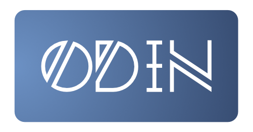

<<<<<<< HEAD

=======
<p align="center">
    
    <br/>
    A fast, concise, readable, pragmatic and open sourced programming language.
    <br/>
    <br/>
    <a href="https://github.com/odin-lang/odin/releases/latest">
        
    </a>
    <a href="https://github.com/odin-lang/odin/releases/latest">
        
    </a>
    <a href="https://github.com/odin-lang/odin/blob/master/LICENSE">
        
    </a>
</p>
>>>>>>> b32af841c56b1bc530b13bd2c6ad55547b4ef021

# The Helm Programming Language

Helm is a medium-level programming language that tries to be the sanity point between C and C++. Helm embraces standardization *and* choice, so that
any Helm code should look similar to any other Helm code whilst allowing programmers to express code in whatever way is appropriate for the task at hand.

Helm is one of those things where you can learn it extremely quickly, but there's always something new you can learn about it.

<<<<<<< HEAD
## This project is a fork of [Odin](https://github.com/odin-lang/Odin).
Odin is a lower-level programming language attempting to replace C. Helm is building on Odin, attempting to create the C++ to Odin's C. That said,
we don't want to make the same mistakes that C++ made. Convenience and complex features are fine, but not if they sacrifice the legibility of the code.

If you're looking for something a little more low-level with less bells and whistles, definitely check out [Odin](https://github.com/odin-lang/Odin) and
see if it's a better fit for your project!
=======
```go
import "core:fmt.odin"

main :: proc() {
	program := "+ + * 😃 - /";
	accumulator := 0;

	for token in program {
		switch token {
		case '+': accumulator += 1;
		case '-': accumulator -= 1;
		case '*': accumulator *= 2;
		case '/': accumulator /= 2;
		case '😃': accumulator *= accumulator;
		case: // Ignore everything else
		}
	}

	fmt.printf("The program \"%s\" calculates the value %d\n",
	           program, accumulator);
}

```

## Demonstrations:
* First Talk & Demo
	- [Talk](https://youtu.be/TMCkT-uASaE?t=338)
	- [Demo](https://youtu.be/TMCkT-uASaE?t=1800)
	- [Q&A](https://youtu.be/TMCkT-uASaE?t=5749)
* [Composition & Refactorability](https://www.youtube.com/watch?v=n1wemZfcbXM)
* [Introspection, Modules, and Record Layout](https://www.youtube.com/watch?v=UFq8rhWhx4s)
* [push_allocator & Minimal Dependency Building](https://www.youtube.com/watch?v=f_LGVOAMb78)
* [when, for & procedure overloading](https://www.youtube.com/watch?v=OzeOekzyZK8)
* [Context Types, Unexported Entities, Labelled Branches](https://www.youtube.com/watch?v=CkHVwT1Qk-g)
* [Bit Fields, i128 & u128, Syntax Changes](https://www.youtube.com/watch?v=NlTutcLyF64)
>>>>>>> b32af841c56b1bc530b13bd2c6ad55547b4ef021

## Requirements to build and run

- Windows
	* x86-64
	* MSVC 2015 installed (C++11 support)
	* [LLVM binaries](https://github.com/gingerBill/Odin/releases/tag/llvm-4.0-windows) for `opt.exe` and `llc.exe`
	* Requires MSVC's link.exe as the linker
		* run `vcvarsall.bat` to setup the path

- MacOS
	* x86-64
	* LLVM explicitly installed (`brew install llvm`)
	* XCode installed (for the linker)

- GNU/Linux
	* x86-64
	* Build tools (ld)
	* LLVM installed
	* Clang installed (temporary - this is calling the linker for now)

## Warnings

* This is still highly in development and the language's design is quite volatile.
* Syntax is not fixed.

## Roadmap

Not in any particular order and not be implemented

* Compile Time Execution (CTE)
	- More metaprogramming madness
	- Compiler as a library
	- AST inspection and modification
* CTE-based build system
* Replace LLVM backend with my own custom backend
* Improve SSA design to accommodate for lowering to a "bytecode"
* SSA optimizations
* Documentation Generator for "Entities"
* Multiple Architecture support
* Debug Information
	- pdb format too
* Command Line Tooling
* Compiler Internals:
	- Big numbers library
	- Multithreading for performance increase
